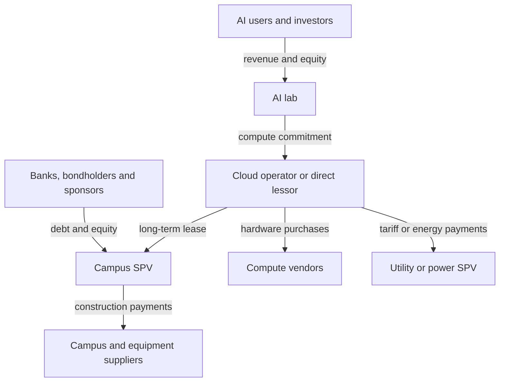

# 001 Current Model

Version: 0.1

---

## One Paragraph Model

An AI datacenter is best understood as a **financed compute factory**, not as a building full of computers. The system begins with an AI lab or cloud provider forecasting demand and making long-term commitments for compute. Those commitments let a developer or special-purpose vehicle finance land, buildings, substations, cooling and other long-lived infrastructure with project debt and sponsor equity; they also justify utilities and energy developers building generation and transmission. A cloud operator or tenant then finances the much more expensive, shorter-lived accelerator and networking layer and combines electricity, cooling, hardware, software and labor into saleable compute. Revenue from consumer subscriptions, enterprise products, APIs and cloud services flows back through this chain as compute payments, rent, energy payments, debt service and supplier revenue. Ownership is deliberately divided: the lab may control the workload without owning the campus, the landlord may own the campus without owning the servers, and the utility may own dedicated power assets while the tenant guarantees their cost. This separation mobilizes more capital and allocates construction, credit and operating risks to actors equipped to hold them, but it does not eliminate the system's central wager: that future AI demand, utilization and gross profit will grow quickly enough to pay for long leases, repeated hardware replacement, electricity and financing. In the Stargate cases studied so far, an initially equipped frontier-AI campus appears to require roughly **$43B-$52B per published GW**, of which about **$13B-$18B/GW** is the long-lived powered campus and roughly **$33B/GW** is the first generation of compute and network equipment. Those figures are an evidence-based range for this particular buildout, not a universal industry price.

---

## System Boundary and Unit of Analysis

This model covers the conversion of **capital, land, electrical capacity, industrial equipment and semiconductors into usable AI compute**, and the conversion of that compute into revenue capable of sustaining the physical system. It includes construction, financing, power, cooling, compute equipment, operation, hardware refresh and demand. It does not attempt to model semiconductor fabrication in detail, the technical possibility of AGI, or stock prices.

The economically productive unit is not a parcel of land, a building, a GPU or a gigawatt by itself. It is a synchronized bundle of:

- firm electrical capacity and a functioning interconnection;
- building shell, substations, switchgear, backup systems and cooling;
- accelerators, CPUs, memory, storage, optics and high-bandwidth networking;
- cluster-management software and trained operators; and
- workloads that use enough of the installed capacity to generate revenue.

A missing or delayed layer can strand the others. A completed shell without power produces no compute; energized racks without a functioning network cannot operate as a training cluster; installed hardware without sufficient workloads produces depreciation rather than useful output.

Capacity claims must therefore be kept in stages:

1. **Announced or planned** — a sponsor has described an intended project.
2. **Contracted** — a tenant, compute buyer or energy customer has made a commitment.
3. **Financed** — debt, equity or balance-sheet capital is committed for a defined phase.
4. **Permitted** — the material land-use, environmental, building and energy approvals exist for that phase.
5. **Under construction** — physical work has begun on that phase.
6. **Energized and equipped** — power is available and compute systems are installed.
7. **Commissioned** — the cluster can run production workloads.
8. **Utilized** — customers are actually buying and using its compute.

These stages are not interchangeable. Neither a project announcement, a maximum bond authorization nor a contracted GW proves that the same capacity is financed, energized or revenue-producing.

The denominator also matters. Published "GW" figures may refer to critical IT load, total facility load, contracted capacity, grid request or installed generation. Per-GW comparisons are valid only when the boundary is stated. See [[AI Stargate-Consolidated-Capital-Stack-Model#Denominator discipline|denominator discipline]].

---

## Actors

| Actor | Goal | Primary constraint / risk |
|---|---|---|
| **AI labs and model companies** | Secure enough compute to train and serve models; turn model capability and usage into revenue | Demand, utilization and gross-margin risk; large fixed compute commitments may outrun revenue |
| **Cloud providers / compute operators** | Buy or lease infrastructure, operate clusters and sell reliable compute capacity | Tenant leases, hardware capex, customer concentration, utilization and rapid hardware obsolescence |
| **Powered-land developers** | Control suitable land, permits, fiber corridors and a credible path to power, then lease or sell that position | Interconnection queues, permitting, transmission delays and the possibility that the customer never proceeds |
| **Campus developers and landlord SPVs** | Build and own the shell, MEP and onsite electrical/cooling plant; collect long-term rent | Construction cost and schedule, tenant credit, refinancing and residual-value risk |
| **Banks and bondholders** | Earn interest from lease-backed or project-backed debt | Completion risk, borrower/tenant default, collateral value and maturity/refinancing mismatch |
| **Infrastructure equity sponsors** | Earn development fees, lease yield and residual asset value | First-loss exposure, cost overruns, leverage and inability to re-lease a highly specialized campus |
| **Utilities and transmission owners** | Sell electricity and earn regulated or contracted returns on generation, wires and substations | Long lead times, ratepayer protection, regulatory approval and stranded dedicated assets |
| **Independent energy developers** | Build generation, storage, microgrids or fuel infrastructure under long-term contracts | Fuel supply, permitting, interconnection, technology performance and offtaker credit |
| **GPU, server and network vendors** | Sell the scarce productive equipment and preserve platform/ecosystem demand | Semiconductor supply, customer concentration, product cycles and the risk of financing or guaranteeing buyers |
| **Semiconductor supply chain** | Supply fabrication, HBM, advanced packaging, optics and components | Long capacity-expansion cycles, high capital intensity, yields and geopolitical concentration |
| **Construction and equipment suppliers** | Deliver buildings, transformers, switchgear, cooling systems, generators and skilled labor | Manufacturing lead times, labor availability, commodity costs and project sequencing |
| **Governments and regulators** | Attract investment and jobs while protecting grids, taxpayers, communities and the environment | Conflicting development, affordability, reliability and environmental goals |
| **Host communities** | Gain durable jobs, tax revenue and infrastructure without bearing excessive cost or environmental harm | Unequal bargaining power, uncertain forecasts, water/noise/emissions impacts and stranded public works |
| **Consumers and enterprise customers** | Buy useful AI products, APIs and cloud services | Price, reliability, usefulness, security and availability of alternatives |

The exact actor can change while the function remains. Oracle is the cloud operator and credit bridge at several Stargate sites; OpenAI contracts directly with the developer at Milam and PORTS-Pike. Utilities own major power assets at Lighthouse and Saline, while dedicated energy entities sit inside the project structure at Jupiter and PORTS-Pike. The model should track the **role, asset owner, financier, payer and risk holder** separately rather than assuming one vertically integrated owner.

---

## Major Flows

### Capital and contractual commitments

1. **Demand is made financeable.** A lab signs a long-term compute purchase, capacity reservation or direct lease.
2. **Credit is transformed.** A cloud provider may stand between the lab and the physical assets, converting the lab's demand into a lease that lenders can underwrite. At some projects, a vendor guarantee or other credit support performs part of this function.
3. **Long-lived assets are project-financed.** The campus SPV raises construction or term debt plus sponsor equity against the lease and project collateral.
4. **Power may be financed separately.** Utilities, transmission companies or energy SPVs invest under tariffs, minimum-payment contracts, collateral requirements or power-purchase agreements.
5. **Short-lived compute is financed by the tenant/operator or another equipment owner.** This layer may sit outside the landlord's disclosed campus budget.
6. **Operating revenue services the chain.** Compute payments support the cloud operator; rent and energy payments support project debt and utility assets; remaining cash must cover refresh capex and equity returns.

Debt principal is a **source of funds**, not an additional project cost. Interest, fees, hedging and construction carry are costs. Likewise, tax-assessed value, bond authorization, project budget, loan proceeds, lease value and multi-year compute revenue are different accounting boundaries and must not be added without reconciliation.

### Information

Information moves ahead of physical construction and coordinates it:

- Labs and cloud operators communicate expected training and inference demand, required delivery dates and technical specifications.
- Designers translate workload requirements into rack density, network topology, electrical redundancy and cooling design.
- Developers submit site plans, building registrations, environmental permits and interconnection requests.
- Utilities produce load studies, transmission plans, tariffs and resource additions.
- Tenants, lenders and guarantors exchange leases, service-level requirements, completion tests, collateral packages and forecasts.
- Operators return utilization, reliability, power and model-performance data, influencing the next procurement cycle.

Poor information can be as damaging as missing equipment. Inflated demand forecasts cause overbuilding; understated load or water requirements delay permits; ambiguous GW definitions cause investors and policymakers to compare unlike projects.

### Materials

The principal physical flow is:

1. Land is assembled, graded and connected to roads, water, gas and fiber.
2. Concrete, steel and prefabricated modules form the shell.
3. Transformers, substations, switchgear, UPS systems, batteries and backup generation create a reliable electrical path.
4. Chillers, heat exchangers, pumps, cooling towers or dry coolers create the thermal path.
5. Racks receive accelerators, CPUs, HBM, storage, power supplies, optics and network switches.
6. Replacement hardware enters repeatedly over the life of the much longer-lived campus.

Land is usually a small share of project cost but can be strategically decisive because the scarce product is **powered land**: a usable site plus permits, transmission access and a credible schedule to energy.

### Energy and heat

Primary energy or grid electricity flows through generation, transmission, substations, power conversion and racks. The compute hardware turns nearly all consumed electricity into heat; cooling equipment then moves that heat to air or water. Energy is therefore both a recurring input and a design constraint.

At full continuous draw, 1 GW equals **8.76 TWh per year** before clarifying whether the quoted GW is IT load or facility load. The Abilene work suggests an order-of-magnitude electricity expense of roughly **$0.3B-$0.6B per GW-year**, but delivered prices, utilization, PUE, demand charges and whether generation capex is embedded elsewhere can move the result materially. See [[AI Abilene Campus Per-GW Cost Stack#3. Electricity: roughly $0.3B-$0.6B per GW-year|Abilene electricity]].

### Compute

Installed electrical capacity becomes saleable compute only after accelerators, memory, network and software are commissioned as a cluster. The operator allocates that capacity among pre-training, post-training, inference, research and external cloud customers. Utilization and workload mix determine whether a nominal GW produces enough billable work; better software or chips can increase useful compute per watt even if physical power capacity is unchanged.

### Revenue

Revenue originates downstream in subscriptions, advertising or product augmentation, enterprise contracts, API usage and rented cloud capacity. It returns upstream as:

- compute payments to the lab's cloud or infrastructure provider;
- rent to the campus owner;
- electricity, capacity and tariff payments to power providers;
- hardware and service revenue to equipment vendors;
- interest and principal to lenders; and
- distributions or asset appreciation for equity sponsors.

Timing differs by actor. Equipment and construction suppliers can recognize revenue during the build, landlords receive contracted rent after delivery, and the lab must create recurring product revenue over many years. One actor's booked revenue can therefore be another actor's long-term liability, and a large backlog can exist before the associated capacity is built or paid for.

---

## Indicative Cost and Asset Stack

This table synthesizes the investigated Stargate campuses. It is a model range, not a bill of materials for every AI datacenter.

| Layer | Indicative magnitude | Typical owner | Economic life / key risk |
|---|---:|---|---|
| Land and site control | Usually financially small; standalone data are sparse | Powered-land developer or campus SPV | Long-lived; value depends on permits, fiber and power access |
| Shell, MEP and onsite power/cooling | **~$13B-$18B per published GW** | Campus landlord SPV | Decades; construction, tenant and re-leasing risk |
| Offsite generation, transmission and storage | Sometimes embedded; sometimes separately utility-financed | Utility, transmission owner or energy SPV | Decades; approval, fuel and stranded-asset risk |
| Initial GPU, host and network systems | **~$33B/GW** in the clearest current observations | Cloud operator, tenant or equipment vehicle | Roughly one technology cycle; obsolescence and utilization risk |
| Initially equipped system | **~$43B-$52B per published GW** | Split across several owners | Boundary and denominator risk; not all announced spend is funded capex |
| Financing cost | Roughly **$0.5B-$1.1B/GW-year** in observed large project structures | Paid through landlord/tenant cash flow | Rates, leverage, construction draws and refinancing |
| Electricity | Roughly **$0.3B-$0.6B/GW-year** in the Abilene sensitivity | Tenant/operator, sometimes through special tariff | Power price, utilization, PUE and demand charges |
| Hardware refresh | Not publicly resolved; potentially the largest recurring capital burden | Compute equipment owner | Faster chips can strand the existing fleet before the building lease ends |

The approximate $50B/GW observation explains how a program can announce hundreds of billions of dollars while no single entity spends that amount. The total can span campus equity, project debt, utility investment, hardware purchases and multi-year service commitments on different balance sheets. It must never be read automatically as cash already funded or construction already completed. See [[AI Stargate-Consolidated-Capital-Stack-Model]].

---

## Bottlenecks

| Bottleneck | Why it constrains the system | Primary exposure |
|---|---|---|
| **Firm power and interconnection** | A campus can be built faster than major generation and transmission; a queue position is not delivered electricity | Developer schedule, tenant delivery, utility reliability and community cost |
| **Transformers, switchgear and electrical labor** | Long-lead equipment and specialized trades gate both grid and campus completion | Construction cost and schedule |
| **Accelerators, HBM, packaging and networking** | A cluster requires the full system, not merely available GPU dies; one missing component strands the rest | Vendor supply and operator commissioning |
| **Cooling at rising rack density** | High-density systems require tightly integrated liquid/air heat rejection and adequate water or dry-cooling capacity | Design performance, local water/noise impacts and energy overhead |
| **Permits, transmission routes and community acceptance** | Air, water, land-use and grid proceedings can outlast the desired build schedule | Completion risk and political durability |
| **Credit and financing capacity** | The projects require tens of billions per GW and often depend on one tenant or compute buyer | Interest cost, collateral, lender concentration and refinancing |
| **Demand and utilization** | Capacity earns a return only if useful workloads exist at prices above power, depreciation and finance costs | Lab and cloud-provider solvency; the ultimate system bottleneck |
| **Hardware refresh** | Compute equipment becomes economically obsolete much faster than buildings and leases | Operator capex and risk of stranded racks or mismatched facility design |

---

## Feedback Loops

### Positive

**Capability-demand-capacity loop:** More compute can enable more capable or cheaper models; better products increase usage and revenue; stronger demand supports larger compute commitments; those commitments finance more capacity.

**Contract-finance loop:** A credible anchor contract lowers financing uncertainty; lower financing cost makes more projects viable; completed projects establish lender confidence and comparable asset values; more capital then enters the sector.

**Scale-learning loop:** Larger orders justify expanded manufacturing of accelerators, HBM, cooling and electrical equipment; supplier scale and engineering learning improve delivery and performance; improved economics stimulate additional orders.

**Infrastructure-control loop:** Scarce powered sites and hardware access improve a firm's ability to deliver models; commercial success improves its access to capital and long-term supply; that access makes the next capacity commitment easier.

### Negative

**Debt-burden loop:** More commitments require more debt, leases and collateral; fixed charges raise the revenue needed to break even; weak utilization or margins damage credit; more expensive financing then slows or cancels expansion.

**Obsolescence loop:** New hardware improves compute per watt and per dollar; the existing fleet becomes less competitive; accelerated refresh raises capital needs and can strand racks, power arrangements and long property leases.

**Grid-delay loop:** Large load requests require new power assets and proceedings; delay raises construction carry and pushes revenue later; deteriorating economics can reduce or phase the request, leaving previously planned infrastructure uncertain.

**Efficiency-demand ambiguity:** Model and hardware efficiency reduce the compute required per task, but lower prices and better products can increase total usage. Efficiency constrains total infrastructure demand only if compute saved grows faster than new demand induced.

**Community-response loop:** Rapid development creates visible grid, land, water, noise or emissions impacts; public resistance increases conditions and delay; stronger protections can improve legitimacy, but unresolved costs can prevent later projects.

---

## Risk Allocation

| Risk                               | First contractual holder          | Where it can ultimately migrate                                                       |
| ---------------------------------- | --------------------------------- | ------------------------------------------------------------------------------------- |
| Land assembly and early permitting | Powered-land developer            | Developer equity or buyer through site price                                          |
| Construction completion and cost   | Developer / EPC / campus SPV      | Equity sponsors, lenders, then tenant through rent or delay                           |
| Tenant default                     | Campus SPV and lenders            | Guarantor, re-leasing market or impaired asset value                                  |
| Hardware price and obsolescence    | Cloud operator or equipment owner | AI lab through compute price; vendors when guarantees or financing are provided       |
| Power-asset stranding              | Utility or energy SPV             | Tenant through minimum bills/collateral, investors, or ratepayers if protections fail |
| Power price and fuel               | Operator / contracted customer    | End users through AI or cloud pricing where competition permits                       |
| Utilization and model demand       | AI lab and cloud operator         | Investors and creditors if product revenue is insufficient                            |
| Refinancing and interest rates     | Leveraged asset owner             | Tenant through lease economics, equity through reduced value, or lenders in default   |

The risk map is as important as the asset map. Legal ownership identifies who holds title; contracts identify who is supposed to pay; credit quality determines who actually absorbs failure.

---

## Current Beliefs

### 1. The system's product is usable compute, not datacenter square footage or installed GPUs

**Confidence:** High

**Supporting evidence:** Every investigated site requires a coordinated power, thermal, network, hardware and software stack. The site reports repeatedly show that a missing power or network layer prevents announced capacity from becoming productive. [[AI Stargate Project System Report#Technical system|Technical system]]

**Contradicting evidence / limit:** Industry announcements and permits often use buildings, chips or GW as proxies because actual useful compute and utilization are rarely public.

### 2. Long-term demand commitments are the mechanism that turns uncertain AI demand into present construction capital

**Confidence:** High for the investigated Stargate projects; medium as a universal industry model

**Supporting evidence:** Abilene, Frontier, Lighthouse and Saline use lease-backed debt; Milam uses a direct OpenAI lease; PORTS-Pike adds NVIDIA residual-value guarantees behind an OpenAI lease. [[AI Stargate-Consolidated-Capital-Stack-Model#Site-by-site ownership and financing|Site ownership and financing]]; [[AI PORTS-Pike-Technology-Campus-Report#The NVIDIA guarantee: what it is and is not|NVIDIA guarantee]]

**Contradicting evidence / limit:** Vertically integrated hyperscalers can finance campuses directly from their own balance sheets, and the exact contracts remain private at many sites.

### 3. Ownership is fragmented, but repayment depends on a much narrower set of demand anchors

**Confidence:** High

**Supporting evidence:** Landlords, utilities, lenders and equipment vendors own different layers, while Oracle and ultimately OpenAI support much of the observed cash flow. Milam and PORTS-Pike change the intermediary, not the dependence on an anchor tenant.

**Contradicting evidence / limit:** A cloud operator may diversify a campus among other customers or re-lease assets, and guarantees can shift losses to vendors or sponsors.

### 4. Roughly $50B per initially equipped GW is a defensible current Stargate benchmark, not a universal construction price

**Confidence:** Medium

**Supporting evidence:** Abilene produces about $45.8B/GW; comparable scenarios and tax/financing observations at Frontier, Lighthouse, Jupiter and Saline cluster around roughly $43B-$52B/GW. [[AI Stargate-Consolidated-Capital-Stack-Model#What is genuinely comparable|Comparable observations]]

**Contradicting evidence / limit:** GW definitions differ, most sites do not disclose a full sources-and-uses schedule, and future chip generations can change both rack density and cost. The range is biased toward unusually large frontier-AI campuses.

### 5. Compute equipment, not land or the shell, is presently the largest and fastest-decaying capital layer

**Confidence:** Medium-high

**Supporting evidence:** Abilene's reported equipment purchase and Saline's personal-property tax value independently indicate about $33B/GW, versus roughly $13B-$18B/GW for powered campuses. [[AI Abilene Campus Per-GW Cost Stack]]; [[AI Stargate-Saline-Township-The-Barn-Report#4. Cost stack and per-GW normalization|Saline cost stack]]

**Contradicting evidence / limit:** Site-level equipment bills are rarely public, personal property includes more than GPUs, and procurement prices will change by hardware generation.

### 6. Power availability is the principal physical bottleneck, while profitable utilization is the principal economic bottleneck

**Confidence:** High

**Supporting evidence:** Every site report is organized around interconnection, new generation, storage, transmission or behind-the-meter power. Conversely, none of those assets repays itself without workloads whose revenue exceeds recurring costs. [[Power Availability]]

**Contradicting evidence / limit:** At a specific project stage, financing, equipment, labor, gas supply or permits may become the immediate critical path.

### 7. Planned GW, funded GW and productive GW should be treated as separate stocks

**Confidence:** High

**Supporting evidence:** PORTS-Pike has contracted and credit-supported future capacity but no confirmed operating MW; other sites show similar gaps among headline scale, registered buildings, power plans and live service. [[AI PORTS-Pike-Technology-Campus-Report#Current state and schedule|PORTS-Pike schedule]]

**Contradicting evidence / limit:** Public disclosures often do not provide enough phase-level detail to measure each stock precisely.

### 8. The buildout is a leveraged claim on future AI cash flow rather than proof that the cash flow already exists

**Confidence:** High

**Supporting evidence:** The observed structure uses large amounts of project debt, long leases, utility commitments and supplier support. Backlog, lease value and investment envelopes describe future obligations and expected revenue, not cash already received. [[AI Stargate-Consolidated-Capital-Stack-Model#Consolidated capital providers and risk holders|Capital providers and risk holders]]

**Contradicting evidence / limit:** Rapid product-revenue growth or broader demand could validate the commitments, while reusable campuses and alternative tenants could reduce losses even if the original forecast fails.

### 9. The central system tension is a duration mismatch

**Confidence:** Medium-high

**Supporting evidence:** Buildings, transmission and many financing agreements last for decades; compute hardware may be economically replaced within a few years; AI product demand is forecast on a still shorter and more uncertain horizon.

**Contradicting evidence / limit:** Older hardware can remain useful for inference or lower-tier workloads, buildings can be retrofitted, and long commitments can be structured in phases rather than funded all at once.

---

## Biggest Unknowns

- [[Can AI product revenue and gross margin support the contracted compute burden?]]
- [[How much announced AI datacenter capacity becomes financed energized and utilized?]]
- [[What are the true site-level hardware bills and refresh cycles?]]
- [[How much useful compute will future hardware and software deliver per watt and dollar?]]
- [[Who bears losses when a specialized AI campus must be re-leased or repurposed?]]
- [[What are the full recurring non-power operating costs of an AI datacenter?]]
- [[How much new generation and transmission is genuinely incremental to AI load?]]
- [[Do efficiency gains reduce aggregate compute demand or induce still more usage?]]
- [[What share of community benefits and infrastructure costs survives after subsidies and risk transfers?]]
- [[How concentrated is upstream exposure across GPU HBM packaging optics and electrical equipment suppliers?]]

---

## Version Changes

**0.1 — 2026-09-09**

- Replaced the initial one-paragraph speculative model with a layered physical, financial and contractual model.
- Added a system boundary, productive unit, project-stage taxonomy and denominator rules.
- Identified the main actors, asset owners, capital providers, payers and risk holders.
- Mapped capital, information, material, energy, compute and revenue flows.
- Added the evidence-based Stargate cost stack, bottlenecks, feedback loops and risk allocation.
- Converted the research to explicit beliefs with confidence levels, supporting evidence, limitations and falsifiable unknowns.

Detailed reasoning is recorded in [[001-revisions]].
