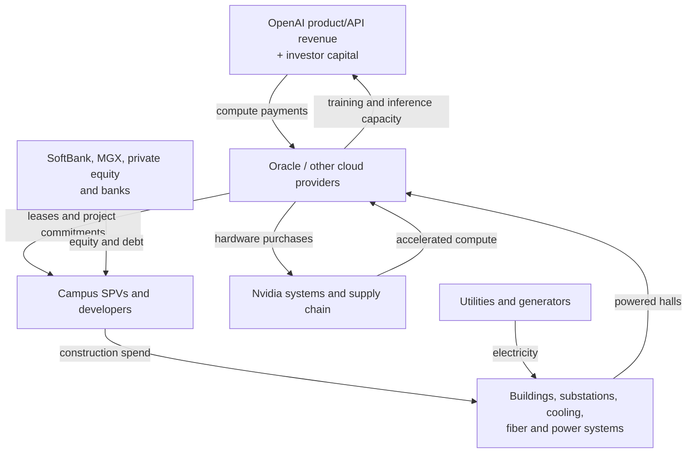

# The Stargate Project — System Report

**As of July 29, 2026**

## Bottom line

Stargate began in January 2025 as a proposed OpenAI–SoftBank joint venture that would “invest $500 billion” in 10 GW of U.S. AI infrastructure by 2029. In practice, it has evolved into an **umbrella for OpenAI’s multi-provider compute-procurement program**, not a single company writing $500 billion of construction checks.

The operating model is:

1. OpenAI creates the demand by signing very large, long-dated compute commitments.
2. Cloud providers—especially Oracle—turn that demand into bankable lease revenue.
3. Data-center developers and special-purpose ownership vehicles borrow against those leases to build campuses.
4. Utilities and energy developers supply gigawatts of power; Nvidia and its manufacturing chain supply the accelerators; Oracle supplies the cloud and network layer.
5. OpenAI monetizes the compute through ChatGPT, enterprise products, and API/model access, then uses that revenue—and continuing external capital—to meet its commitments.

The headline number is therefore best understood as a **four-year envelope of planned infrastructure and contracted compute value**, assembled across many balance sheets. It is not $500 billion of cash sitting in Stargate LLC. [OpenAI’s original announcement](https://openai.com/index/announcing-the-stargate-project/) named $100 billion for immediate deployment but disclosed neither a funded balance sheet nor binding project schedule.

## The players and what each actually supplies

| Player | Function in the system | Economic position |
|---|---|---|
| **OpenAI** | Specifies workloads, directs infrastructure strategy, and serves as the anchor compute customer | Takes demand risk: its product revenue must ultimately support enormous fixed compute commitments |
| **SoftBank** | Original financial lead and Stargate chair; equity investor in OpenAI and infrastructure developer through SB Energy | Supplies risk capital and organizes financing; gains exposure to both OpenAI and the physical infrastructure serving it |
| **Oracle** | Cloud operator and systems integrator; leases campuses, installs GPU/network systems, and sells OCI capacity to OpenAI | Converts OpenAI’s purchase commitments into cloud revenue while assuming major capex, lease, financing, and customer-concentration risk |
| **MGX** | Abu Dhabi state-backed AI investment vehicle and original equity funder | Supplies sovereign capital and links U.S. Stargate to UAE investment and market access |
| **Microsoft** | OpenAI investor, IP/commercial partner, and Azure supplier | Not a Stargate equity funder. Azure remains the exclusive cloud for stateless OpenAI APIs, and Microsoft’s revenue-sharing arrangement includes OpenAI’s third-party cloud partnerships ([joint statement, February 2026](https://openai.com/index/continuing-microsoft-partnership/)) |
| **Nvidia** | GPU systems, networking, and software ecosystem | Captures a large share of the hardware spend; its chips are the scarce, rapidly depreciating productive asset |
| **Arm** | CPU instruction-set and design IP used in supporting compute | Upstream technology licensor rather than project financier/operator |
| **Crusoe** | Designs, builds, and operates the Abilene data-center buildings | Developer/operator paid to deliver a specialized, liquid-cooled campus |
| **Lancium** | Land, ERCOT-approved grid interconnection, power orchestration, storage/renewables integration at Abilene | Monetizes scarce “powered land”—land plus a viable path to gigawatt-scale electricity |
| **Blue Owl / Primary Digital / lenders** | Equity and project debt for campus-owning vehicles | Receive lease-backed infrastructure returns; bear construction, refinancing, tenant, and residual-value risk |
| **Utilities, generators, construction firms, equipment suppliers** | Electricity, substations, transmission, gas backup, fiber, cooling, transformers, buildings, and labor | Convert financial commitments into the physical plant; power availability is the principal deployment bottleneck |
| **U.S. and partner governments** | Permitting, grid policy, chip export controls, incentives, and sovereign agreements | Primarily enable and constrain the system; the original announcement was not a $500 billion federal appropriation |

Reports at launch said OpenAI and SoftBank would each commit about **$19 billion** and hold roughly 40% of the JV apiece; the rest was expected from Oracle, MGX, outside investors, and substantial debt. Those terms were reported, not fully disclosed in public definitive agreements. [Reuters summarized the reported commitments](https://www.reuters.com/technology/openai-softbank-each-commit-19-bln-stargate-data-center-venture-information-2025-01-23/).

## Resource and cash flow

The financing logic is classic project finance with an AI twist. A long-term tenant or compute buyer makes a project financeable; the project vehicle raises debt and equity; the completed asset generates lease revenue that services the debt. The complication is that the chain ultimately depends heavily on one still-loss-making anchor customer—OpenAI—and on equipment whose economic life is much shorter than the building or lease.

### Abilene: the clearest worked example

The flagship is not owned end-to-end by Stargate:

- Lancium assembled the site and a **1.2 GW ERCOT-approved interconnection** ([Lancium](https://lancium.com/locations/)).
- Crusoe is developing and operating eight planned buildings.
- Funds managed by Blue Owl, Primary Digital, Crusoe, and lenders capitalized the asset. The first 206 MW phase was announced in October 2024 as a **$3.4 billion fully funded forward takeout**, before Stargate’s public launch. The site was already 100% long-term leased to an unnamed hyperscaler ([Lancium/Crusoe announcement](https://lancium.com/2024/10/15/crusoe-blue-owl-capital-and-primary-digital-infrastructure-enter-3-4-billion-joint-venture-for-ai-data-center-development/)).
- The expanded 1.2 GW campus was later described as a **$15 billion joint venture** ([Crusoe, May 2025](https://www.crusoe.ai/resources/newsroom/crusoe-blue-owl-capital-and-primary-digital-infrastructure-enter-joint-venture)).
- Oracle is the direct tenant/cloud operator; OpenAI is Oracle’s compute customer. Oracle began delivering Nvidia GB200 systems in June 2025, and training and inference workloads subsequently began.

This layering spreads risk. Real-estate investors need not understand frontier-model economics if Oracle’s lease is sound; Oracle need not own all the land and buildings if it can lease them; OpenAI avoids owning every physical asset. But risk is transferred, not eliminated: lenders and landlords depend on Oracle, while Oracle’s return depends on OpenAI consuming and paying for the capacity.

## What the numbers mean

- **$500 billion / 10 GW = $50 billion per planned GW.** That ratio is not simply building cost. It can include GPU systems, electrical infrastructure, financing, and multi-year cloud/service commitments.
- The flagship’s **$15 billion / 1.2 GW = about $12.5 billion per GW** of project capitalization. The gap versus $50 billion/GW is evidence that the headline total and campus construction budgets are not like-for-like.
- OpenAI and Oracle’s 4.5 GW expansion was described as a partnership exceeding **$300 billion over five years**—roughly $60 billion per year, or $13.3 billion per GW-year if fully utilized. This is principally a long-term compute purchase relationship, not a single upfront capital expenditure. [OpenAI’s September 2025 site announcement](https://openai.com/index/five-new-stargate-sites/).
- At continuous full draw, **1.2 GW consumes 10.5 TWh per year** and 10 GW consumes **87.6 TWh per year**, before resolving whether the quoted capacity is total facility load or IT load. That makes electricity procurement and interconnection—not land—the hard physical constraint.

Oracle’s backlog shows how the commercial promise appears in financial statements. After signing several enormous AI contracts, Oracle reported remaining performance obligations of **$455 billion** in September 2025 ([Oracle SEC exhibit](https://www.sec.gov/Archives/edgar/data/1341439/000119312525199175/orcl-ex99_1.htm)). RPO is contracted future revenue, not cash received, and it does not mean the corresponding capacity already exists. Oracle must first finance, lease, equip, and energize the sites.

Moody’s consequently highlighted counterparty concentration and the possibility that Oracle’s debt could grow faster than EBITDA, with prolonged negative free cash flow ([Reuters](https://www.reuters.com/business/moodys-flags-risk-oracles-300-billion-recently-signed-ai-contracts-2025-09-17/)). This is the central financial tension: OpenAI is using long-term demand commitments to mobilize capital far beyond its own balance sheet, while suppliers and financiers bet that future AI revenue will arrive before the obligations become burdensome.

## Technical system

Stargate is a vertically integrated compute factory:

1. **Power:** grid interconnections, substations, transmission, batteries, and on-site generation. Abilene connects to ERCOT and is located near abundant West Texas wind, but “near wind” is not the same as running solely on wind; the campus draws from the grid and uses gas generation for reliability.
2. **Thermal plant:** direct-to-chip liquid cooling and closed-loop water systems. These reduce operational water consumption relative to evaporative cooling but require additional heat-rejection equipment and electricity.
3. **Compute:** Nvidia GB200-class systems at the initial campus. OpenAI said more than **2 million chips** would be deployed across the first 5+ GW, although “chips” is not a precise accelerator count.
4. **Network:** extremely high-bandwidth, low-latency fabrics are required to make hundreds of thousands of accelerators behave as one training cluster. Oracle’s disclosed design uses its Acceleron RoCE fabric and is intended to connect clusters across nearby buildings ([Oracle Zettascale10](https://www.oracle.com/news/announcement/ai-world-oracle-unveils-next-generation-oci-zettascale10-cluster-for-ai-2025-10-14/)).
5. **Cloud/control layer:** Oracle schedules capacity, operates the hardware, and exposes it to OpenAI. OpenAI then allocates it between pre-training, post-training, and inference.

The productive unit is therefore not “a GPU.” It is a synchronized bundle of accelerator, memory, network, power, cooling, software, and utilization. A shortage or delay in any one layer strands the others.

## Current status and interpretation

OpenAI said in January 2026 that Abilene was already training and serving models and that multiple sites in Texas, New Mexico, Wisconsin, and Michigan were under development, with more than half of the 10 GW target in **planned** capacity ([OpenAI](https://openai.com/index/stargate-community/)). A 1 GW Michigan campus broke ground in June 2026 ([OpenAI](https://openai.com/index/stargate-michigan-data-center/)).

However, the organizational form changed. The *Financial Times* reported in April 2026 that the partners had sidelined first-party Stargate-owned data centers in favor of leasing capacity from multiple developers and cloud providers ([FT](https://www.ft.com/content/664a57e2-dffa-401e-81ad-55129ffb0e89)). OpenAI’s own language now calls Stargate a “program,” “platform,” or “long-term effort.” The projects are real; the original image of one new, centrally funded infrastructure company is not an accurate description of how most deployment is occurring.

### What would falsify the investment thesis?

- OpenAI revenue and gross margin fail to scale fast enough to cover fixed compute commitments.
- GPU price/performance improves so quickly that older leased clusters become uneconomic before long property leases expire.
- Power, transmission, transformers, or permitting delay capacity beyond contracted start dates.
- Oracle or project lenders can no longer fund expansion at acceptable rates.
- Inference demand becomes cheaper or more efficient faster than aggregate usage grows.

### Best next research leads

1. Reconstruct Oracle’s Stargate exposure from debt, leases, capex, and RPO rather than treating the $300 billion contract as revenue already earned.
2. Build a per-GW cost stack: site/power, shell, electrical and cooling plant, GPU/network hardware, energy, financing, and operations.
3. Track OpenAI revenue and cash burn against annualized compute commitments.
4. Map the semiconductor flow behind Nvidia systems: TSMC fabrication, HBM from SK Hynix/Samsung/Micron, advanced packaging, optics, and server assembly.
5. Compare planned GW, energized GW, installed accelerator capacity, and actually utilized compute; announcements often collapse these four different stages.

