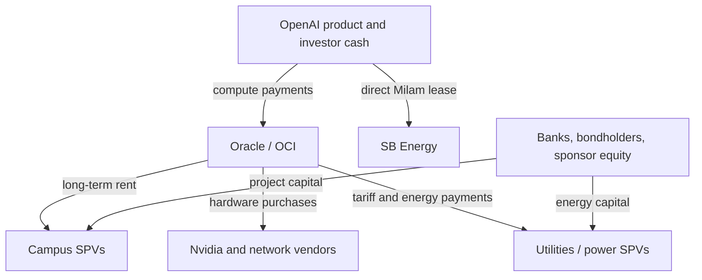

# Stargate — Consolidated Capital-Stack Model

**As of August 19, 2026**

## Bottom line

Stargate does not have one capital stack. It has a repeated commercial chain assembled through different project companies:

1. A land/power developer controls a site and a path to electricity.
2. A campus owner raises project debt and sponsor equity against a long-term lease.
3. Oracle—or, at Milam, OpenAI directly—anchors that lease.
4. Oracle generally finances and operates the short-lived GPU/network layer and sells compute to OpenAI.
5. Utilities or separate energy companies sometimes own the generation, transmission, substations, or storage and recover their capital through a tariff or energy agreement.

Across the sites with the cleanest boundaries, the **powered-campus layer clusters around $12.5B–$18.5B per GW**. Abilene's reported Nvidia purchase supplies the only site-specific compute proxy: approximately **$33.3B/GW**. Combining those layers produces an initial all-in range of roughly **$46B–$52B/GW**, close to the Stargate headline ratio of **$500B / 10 GW = $50B/GW**. The headline is therefore economically plausible as a fully equipped system envelope. It is not evidence that $500B has been funded or spent.

The crucial ownership fact is that OpenAI usually does **not** own the land, building, utility plant, or even the accelerators. Its long-term compute demand supports Oracle; Oracle's lease supports the campus SPV; the SPV's lease revenue supports bank or bond debt. The assets and liabilities sit on several balance sheets, but the revenue required to service them ultimately depends on OpenAI.

## Scope

This model consolidates the six U.S. sites already supported by companion reports:

- [[AI Abilene Campus Per-GW Cost Stack|Abilene, Texas]]
- [[AI Stargate-Shackelford-County-Frontier-Report|Frontier, Shackelford County, Texas]]
- [[AI Stargate-Milam-County-Freebird-Report|Milam County, Texas]]
- [[AI Stargate-Dona-Ana-County-Project-Jupiter-Report|Project Jupiter, Doña Ana County, New Mexico]]
- [[AI Stargate-Port-Washington-Lighthouse-Report|Lighthouse, Port Washington, Wisconsin]]
- [[AI Stargate-Saline-Township-The-Barn-Report|The Barn, Saline Township, Michigan]]

**Lordstown is excluded.** The evidence now supports treating it as an engineering/manufacturing hub for modular data-center equipment, not as a hyperscale compute campus. A distinct SB Energy **PORTS/Pike County, Ohio** campus was announced on August 17, 2026; it is not Lordstown and is not folded into this model because it does not yet have a companion site report or a reconciled site-level cost stack. Early reporting describes an 8 GW OpenAI lease, Nvidia credit support, and a much larger integrated generation program, making it a high-priority next addition rather than a correction to Lordstown. ([Reuters](https://www.reuters.com/business/media-telecom/nvidia-invest-15-billion-sb-energy-under-openai-data-center-deal-2026-08-17/))

## Evidence and accounting rules

- **Disclosed:** stated by a project company, utility, government body, or filing.
- **Reported:** credible financial reporting, but not confirmed in a public definitive agreement.
- **Registered/authorized:** permit, tax, bond, or incentive value; not necessarily actual spend.
- **Derived:** arithmetic from disclosed, reported, or registered inputs.
- **Scenario:** explicit comparability calculation; not a site forecast.
- **Unknown:** no reliable public number found.

Three rules prevent most double counting:

1. **Debt principal is a funding source, not an extra cost layer.** Interest, fees, hedging, and reserves are financing costs.
2. **Tax value, financing proceeds, and project cost are different boundaries.** Saline's $43.1B tax application cannot be added to its $16B financing; Jupiter's $165B IRB authorization cannot be treated as day-one capex.
3. **Utility collateral is not construction capex.** Lighthouse's potential $7B Oracle security requirement protects regulated assets; it does not mean the campus costs another $7B.

## Denominator discipline

“GW” does not mean the same thing at every site. This is the model's largest remaining comparability problem.

| Site | Published denominator used here | Boundary | Comparability |
|---|---:|---|---|
| Abilene | 1.2 GW | Advertised campus power capacity; IT versus facility boundary not fully defined | Medium |
| Frontier | 1.4 GW | **Critical IT load** | High |
| Milam | 1.2 GW | Lease capacity; IT versus facility boundary undisclosed | Medium-low |
| Jupiter | 2.45 GW | **Installed fuel-cell generation**, not critical IT | Low for cross-site comparison |
| Lighthouse | 902 MW | **Critical IT load**; utility request is 1.3 GW | High |
| Saline | 1.0 GW | Project-labeled compute capacity; utility contract is 1.383 GW | High-medium |

Jupiter's per-GW figures will be higher if normalized to its undisclosed IT load. Abilene and Milam may also shift once their capacity boundaries are defined.

## Consolidated per-GW model

### Comparable layer table

All values are **billions of dollars per published GW**. “Embedded” means the cost exists but cannot be separated from a broader disclosed number.

| Site | Land/site | Shell + MEP | Power infrastructure | GPU + networking | Financing cost | Best initial all-in view |
|---|---:|---:|---:|---:|---:|---:|
| **Abilene** | Unknown; embedded in Lancium/JV arrangements | **$12.5** powered-campus bundle | Embedded; separate Lancium debt is $0.5/GW but partly platform-wide | **~$33.3 reported proxy** | **$0.47–$0.63/GW-year** at full $9.4B debt draw and 6%–8% | **~$45.8/GW** before financing cost |
| **Frontier** | Unknown; embedded | **$7.60 registered** for ten buildings + support | At least part of **$10.26/GW unreconciled delta** to the $25B headline; not separable | Unknown; **$33.3 scenario** | **~$1.02/GW-year** on reported $23.25B debt at current SOFR + 250 bp | **>$51.2/GW scenario** |
| **Milam** | Unknown; embedded in >$3B campus floor | Phase 1 is $470M but has no MW; campus floor is **>$2.5/GW** across site/build/power | New generation announced; MW and cost unknown | Unknown; **$33.3 scenario** | Unknown; only platform equity disclosed | **>$35.8/GW floor scenario**, visibly incomplete |
| **Jupiter** | Embedded in building/site authorization | **$10.2 authorization** for four site/building entities | **$6.1 authorization** for microgrid | **$51.0 authorization** over 30 years; **$33.3 initial scenario** | **~$0.45/GW-year of generation** on reported $18B loan at current SOFR + 250 bp | **~$49.6/GW initial scenario**; $67.3/GW is a 30-year IRB ceiling |
| **Lighthouse** | **~$0.13/GW**, based on roughly $120M assembled land; already inside campus budget | **>$16.63 powered-campus bundle**, including land and onsite systems | **$1.44–$1.88/GW** ATC transmission, if incremental | Unknown; **$33.3 scenario** | **~$1.01/GW-year** on reported $14.75B debt at current SOFR + 250 bp; Oracle collateral carrying cost separately >$0.11/GW-year | **~$49.9/GW** before transmission; **~$51.3–$51.8/GW** if grid cost is incremental |
| **Saline** | Embedded; project uses 250 developed acres within 575 acres | **~$9.9/GW real-property tax value**; broader landlord financing is **$16.0/GW** | **~$0.5/GW** grid connection + **~$2.0/GW** storage, but ownership/boundary overlaps forbid addition | **~$33.2/GW personal-property tax value**, likely mostly compute/network plus movable MEP | **~$1.05/GW-year** coupon on reported $14B bonds at 7.5% | **~$43.1/GW tax-basis view**; do not add the $16B financing again |

### What is genuinely comparable

The strongest cross-site observations are:

- **Powered campus:** Abilene $12.5B/GW; Frontier >$17.9B/GW; Lighthouse >$16.6B/GW before regional transmission; Saline $16B/GW of project financing. Jupiter's $16.3B/GW power-plus-building authorization lands in the same band, but its denominator is generation and its values are ceilings.
- **Compute:** Abilene's reported Oracle purchase is approximately $33.3B/GW. Saline's $33.2B/GW personal-property application independently lands near the same value, although it includes more than GPUs and may include movable MEP.
- **All-in:** Abilene is approximately $45.8B/GW. Frontier and Lighthouse produce approximately $51B/GW when the Abilene compute proxy is applied. Jupiter produces approximately $49.6B/GW on its generation denominator. Saline's broader tax-basis view is $43.1B/GW before separately owned utility assets.
- **Outlier:** Milam's >$2.5B/GW disclosed campus floor is not evidence of a cheap full build. Its missing generation, later buildings, MEP, and IT layers explain the gap.

The defensible current range is therefore **about $43B–$52B/GW for an initially equipped AI campus**, with approximately two-thirds to three-quarters of value in compute hardware and networking rather than land and buildings.

## Site-by-site ownership and financing

### 1. Abilene: two real-estate layers beneath Oracle

| Layer | Owner / operator | Financier / repayment source |
|---|---|---|
| Land, interconnection, substations, powered campus platform | **Lancium Abilene LLC / Lancium** owns the powered-land package and leases land to Crusoe; Lancium is a Blackstone portfolio company | **$600M Lancium debt** led by Santander supports Abilene and provides portfolio flexibility; exact Abilene allocation is undisclosed ([Lancium](https://lancium.com/2025/10/16/lancium-secures-600-million-debt-financing/)) |
| Eight powered buildings, cooling and onsite electrical/MEP | JV sponsored by **Crusoe, Blue Owl-managed funds, and Primary Digital Infrastructure**; Crusoe designs, builds, and operates | **$9.4B construction debt**: $2.3B first phase + $7.1B expansion, both JPMorgan-led; approximately $5.6B implied equity/other capital within the $15B JV ([Crusoe](https://www.crusoe.ai/resources/newsroom/crusoe-blue-owl-capital-and-primary-digital-infrastructure-enter-joint-venture), [Newmark phase one](https://www.nmrk.com/insights/press-releases/newmark-arranges-2-3-billion-construction-financing-for-206-mw-build-to-suit-data-center), [phase two](https://www.nmrk.com/insights/press-releases/newmark-facilitates-7-1-billion-construction-loan-to-develop-ai-data-center)) |
| GPU, host and network systems | **Oracle** is the tenant and OCI operator; reported plan was roughly $40B for 400,000 Nvidia GB200-class chips/systems | Oracle finances the IT layer and recovers it through its 15-year compute relationship with OpenAI; exact hardware debt, networking scope, and refresh reserve are undisclosed ([Financial Times](https://www.ft.com/content/a9cd130f-f6bf-4750-98cc-19d87394e657)) |
| Final demand | **OpenAI** consumes OCI capacity | OpenAI's compute payments support Oracle, whose lease supports the campus debt |

Abilene's $15B campus capitalization equals **$12.5B/GW**. The debt/equity split is approximately **63% / 37%**, or **$7.83B debt and $4.67B equity per GW**. The $40B reported hardware layer adds approximately **$33.3B/GW**, producing **$45.8B/GW** before financing cost.

### 2. Frontier: Vantage project debt against an Oracle lease

| Layer | Owner / operator | Financier / repayment source |
|---|---|---|
| 1,200-acre site and ten-building campus | **Vantage Data Centers** through TX301–TX310 building SPVs; Oracle is the registered occupant | Vantage sponsors **DigitalBridge and Silver Lake** supply equity; a later reported financing allocated **$23.25B of term debt** to the Texas project, led by JPMorgan and MUFG. Earlier reporting described $22B debt + $3B equity. Public closing/syndication detail remains incomplete ([Vantage](https://vantage-dc.com/news/vantage-data-centers-unveils-plans-for-frontier-a-25b-mega-campus-in-texas-to-meet-unprecedented-ai-demand/), [Reuters](https://www.reuters.com/business/finance/jpmorgan-mufg-near-22-billion-data-center-financing-deal-texas-ft-reports-2025-08-20/), [DCD on the later package](https://www.datacenterdynamics.com/en/news/oracle-set-to-receive-38bn-debt-package-for-data-center-projects-report/)) |
| Buildings and MEP | Vantage building SPVs | Texas filings total **$10.639B**, or $7.60B/GW; funded inside the broader Vantage capital stack |
| Onsite gas microgrid | Vantage/VoltaGrid development relationship; final asset owner and full-site allocation are undisclosed | The initial roughly 700 MW phase is likely inside the $25B campus or associated energy arrangements, but no public sources-and-uses schedule proves the allocation |
| GPU/network systems | **Oracle** is the cloud tenant/operator; OpenAI is the compute customer | Hardware budget and financing are undisclosed; the $25B Vantage number should not be assumed to include Oracle's accelerators |

The 1.4 GW campus has **>$17.86B/GW** of disclosed Vantage investment. Registered buildings explain $7.60B/GW; at least $10.26B/GW remains unreconciled across land, power, outside-the-permit MEP, financing reserves, contingencies, and other scope.

### 3. Milam: direct OpenAI lease to an integrated power developer

| Layer | Owner / operator | Financier / repayment source |
|---|---|---|
| 595-acre campus and building SPVs | **SB Energy / Milam County Data Center LLC**, with building SPVs MDC Building 1 and 2; SB Energy will build and operate | **OpenAI and SoftBank each invested $500M in SB Energy**; Ares previously supplied **$800M of redeemable preferred equity**. These are platform funds, not Milam-only sources ([SB Energy](https://sbenergy.com/openai-and-softbank-group-partner-with-sb-energy/)) |
| Shell/MEP | SB Energy project companies; DPR/Sundt deliver Phase 1 | The only site budget is **>$3B**; Phase 1's registered building cost is $470M with no disclosed MW |
| New generation and powered infrastructure | SB Energy says it will build new generation | Technology, MW, ownership SPV, capex, debt, fuel, and timetable are undisclosed. The adjacent Orion solar output is contracted to Google, not OpenAI |
| GPU/network systems | Contractual user is **OpenAI**; equipment owner has not been publicly identified | Unknown. A direct 1.2 GW OpenAI lease makes OpenAI—not Oracle—the demand anchor, but it does not prove OpenAI owns the hardware |

Milam is the only current U.S. site using a clearly disclosed **direct OpenAI-to-developer lease**. That removes Oracle from the real-estate payment chain but leaves most of the capital sources-and-uses invisible.

### 4. Project Jupiter: tax-title IRBs layered over private project finance

| Layer | Economic owner / operator | Legal title / financier |
|---|---|---|
| Land/site and development platform | **BorderPlex Digital Assets and STACK Infrastructure** sponsor the campus | During the IRB term, **Doña Ana County holds bare legal title** and leases assets back. The county supplies tax treatment, not its credit or cash ([Doña Ana County](https://www.donaana.gov/about_us/economic_development_projects.php)) |
| 2.45 GW fuel-cell microgrid | **Yucca Growth Infrastructure LLC**; Bloom supplies the fuel cells; Oracle says it will bear all energy infrastructure and electricity costs | Series 2025A authorization: **$15B**, or $6.1B/GW of installed generation. Actual Bloom/EPC spend and capital source are undisclosed ([Oracle](https://www.oracle.com/news/announcement/oracle-borderplex-and-bloom-energy-to-power-project-jupiter-with-fuel-cell-technology-2026-04-27/)) |
| Four building/site entities | Four **Red Chiles** project companies | Series 2025B authorization: **$25B**, or $10.2B/GW of installed generation |
| Tenant/equipment | **Green Chile Ventures LLC / Oracle** sits in the tenant/equipment layer; OpenAI is the downstream compute customer | Series 2025C authorization: **$125B**, or $51.0B/GW over 30 years; large enough to include repeated hardware refresh, not just initial GPUs |
| Private debt/equity | Project companies and sponsors | Financial reporting identifies roughly **$18B of four-year project debt** from a 20-bank group led by SMBC, BNP Paribas, Goldman Sachs, and MUFG at SOFR + 250 bp; separate reporting identified approximately $3B of Blue Owl capital. Definitive public allocation by IRB series is unavailable ([Reuters](https://www.reuters.com/business/finance/banks-lend-18-billion-oracle-tied-data-center-project-bloomberg-news-reports-2025-11-07/), [DCD](https://www.datacenterdynamics.com/en/analysis/openai-building-stargate-nvidia-oracle-chatgpt/)) |

The **$165B IRB ceiling is a tax-advantaged eligible-investment envelope**, not county borrowing and not proven spend. A bond purchaser may be a project affiliate or a third party; the project company repays principal and interest. The county cannot use public funds for debt service.

### 5. Lighthouse: Vantage owns the campus; the regulated system owns the wires and generation

| Layer | Owner / operator | Financier / repayment source |
|---|---|---|
| Roughly 1,644 acres; 672-acre active campus | **Vantage Data Centers** | Local officials put assembled land cost near **$120M**, about $0.13B/GW of critical IT; land is already within the $15B+ Vantage budget ([WPR](https://www.wpr.org/news/wisconsin-city-approves-development-data-center)) |
| Four powered buildings, MEP and onsite substation | Vantage; Oracle is tenant | **$14.75B reported term loan**, part of a $38B Texas/Wisconsin package led by JPMorgan and MUFG, at roughly SOFR + 250 bp; DigitalBridge/Silver Lake provide sponsor equity at the Vantage platform level ([DigitalBridge](https://www.digitalbridge.com/news/2024-06-13-vantage-data-centers-completes-92-billion-equity-investment-led-by-digitalbridge-and-silver-lake), [reported debt package](https://www.datacenterdynamics.com/en/news/oracle-set-to-receive-38bn-debt-package-for-data-center-projects-report/)) |
| Regional transmission | **American Transmission Company** | ATC/regulated utility capital, estimated at $1.3B–$1.7B, recovered under regulatory arrangements rather than owned by Vantage |
| Generation/resource additions | **We Energies** and third-party resource owners | Utility balance sheet and PPAs, recovered through the very-large-customer tariff. Oracle bears dedicated-asset risk through minimum payments and credit support ([We Energies](https://www.we-energies.com/payment-bill/very-large-customer-rate)) |
| GPU/network systems | **Oracle** cloud tenant/operator; OpenAI downstream customer | Hardware capex and financing undisclosed; Oracle's Wisconsin sales/use-tax certification covers the tenant layer |

Oracle estimated the utility tariff could require **more than $7B of collateral** and more than $100M/year of carrying cost. That is credit support, not an asset cost. It transfers stranded-asset risk from ordinary customers toward Oracle and its banks.

### 6. Saline: long-dated project bonds plus customer-supported utility storage

| Layer | Owner / operator | Financier / repayment source |
|---|---|---|
| 575-acre project area; 250-acre developed campus | **Related Digital project company**, backed by Related and Blackstone; Oracle is tenant | Part of the $16B campus financing; standalone land price is undisclosed |
| Three powered buildings and MEP | Related Digital / Blackstone-sponsored project | **$14B of fixed-rate 144A bonds** plus approximately **$2B equity**. PIMCO bought about $10B; other institutions bought the balance. Bank of America structured the deal. Reported coupon is 7.5%, maturity 2045 ([Related/BofA](https://newsroom.bankofamerica.com/content/newsroom/press-releases/2026/04/related-digital-announces-financing-for--16-billion-oracle-data-.html), [reported bond terms](https://qz.com/related-digital-blackstone-oracle-michigan-data-center-16-billion-042726)) |
| Transmission and industrial substation | **DTE / transmission providers**, with customer-responsibility provisions | Approximately $200M transmission + $300M substation. A $40M nonrefundable landlord advance is part of funding, not necessarily extra cost |
| 1,383 MW / 5.532 GWh storage portfolio | **DTE** expects approximately 65% utility ownership and 35% third-party ownership | Green Chile/Oracle pays the actual revenue requirement over 15 years; DTE describes nearly $2B of investment ([MPSC](https://www.michigan.gov/mpsc/commission/news-releases/2025/12/18/mpsc-approves-dte-electric-energy-contracts-for-data-center)) |
| GPU/network and movable equipment | **Green Chile Ventures / Oracle** tenant layer; OpenAI downstream customer | The tax-exemption application assigns approximately $33.2B to personal property. It likely contains most compute/network equipment plus some movable MEP, but no itemized schedule is public |

Saline is the cleanest financing-cost observation. At a reported 7.5% coupon, $14B of debt requires approximately **$1.05B/year of coupon interest**, or **$1.05B/GW-year** before fees, original-issue discount, hedging, amortization, and refinancing. Oracle's lease supports those bonds; OpenAI's compute payments support Oracle.

## Financing-cost model

Financing cost should be shown separately from debt principal and separately from construction capex because public project budgets may already include capitalized interest and reserves.

For variable-rate loans reported at **SOFR + 250 bp**, the August 18, 2026 SOFR fixing was **3.65%**, producing a current-rate proxy of **6.15%** before fees, floors, hedges, and unused-commitment charges. ([New York Fed](https://www.newyorkfed.org/markets/reference-rates/sofr))

| Site | Debt used in model | Rate basis | Full-draw cash interest | Per published GW-year | Illustrative construction interest* |
|---|---:|---:|---:|---:|---:|
| Abilene | $9.4B closed construction loans | Terms undisclosed; 6%–8% sensitivity | $0.56B–$0.75B/year | **$0.47B–$0.63B** | **$0.47B–$0.63B/GW** |
| Frontier | $23.25B reported term loan | SOFR + 250 bp; 6.15% snapshot | ~$1.43B/year | **~$1.02B** | **~$1.53B/GW** |
| Milam | Unknown project debt | Unknown | Unknown | **Unknown** | **Unknown** |
| Jupiter | $18B reported project loan | SOFR + 250 bp; 6.15% snapshot | ~$1.11B/year | **~$0.45B per GW of generation** | **~$0.68B/GW of generation** |
| Lighthouse | $14.75B reported term loan | SOFR + 250 bp; 6.15% snapshot | ~$0.91B/year | **~$1.01B** | **~$1.51B/GW** |
| Saline | $14B reported bonds | 7.5% fixed coupon | ~$1.05B/year | **~$1.05B** | **~$1.05B/GW** |

\*Illustrative construction interest assumes a linear draw and two construction years for Abilene/Saline or three for Frontier/Jupiter/Lighthouse: `debt × rate × years ÷ 2`. It is a sensitivity, not a claim about draw schedules or capitalized-interest accounting. Do not add it mechanically to disclosed project budgets.

The table shows why the financing layer matters even before principal repayment. At full draw, the large Vantage and Saline structures imply approximately **$1B of annual interest per GW**. That burden sits on the landlord SPV first, but lease pricing passes it to Oracle; Oracle then must recover it from OpenAI and other OCI revenue.

## Consolidated capital providers and risk holders

| Capital source | Where it appears | What it owns or is exposed to | Primary repayment / return source |
|---|---|---|---|
| JPMorgan-led bank groups | Abilene; Frontier/Lighthouse | Construction and term loans secured by project assets and leases | Oracle rent / project-company cash flow |
| MUFG and syndicate banks | Frontier/Lighthouse; Jupiter | Large floating-rate project loans | Oracle lease and project-company cash flow |
| PIMCO and institutional bond investors | Saline | 2045 project bonds | Oracle-backed lease payments |
| Blue Owl / Primary Digital | Abilene JV; reported Jupiter capital | Campus equity and real-asset exposure | Rent, residual asset value, refinancing or sale |
| DigitalBridge / Silver Lake | Vantage platform, Frontier, Lighthouse | Sponsor equity in campus developer | Lease yield and Vantage platform value |
| Related / Blackstone | Saline | Approximately $2B sponsor equity and project ownership | Residual cash flow after bond debt |
| SoftBank / OpenAI / Ares | SB Energy platform and Milam | Common and preferred platform equity | Direct OpenAI lease and future SB Energy campuses |
| Santander | Lancium | $600M powered-land/platform debt | Site leases and Lancium asset cash flow |
| Utilities / transmission owners | Lighthouse and Saline | Generation, transmission, substations, batteries | Special tariffs, minimum bills, collateral, and customer-paid revenue requirements |
| Oracle | Tenant IT, long-term leases, utility commitments | Accelerator obsolescence, lease liability, customer concentration, utility collateral | OpenAI and other OCI compute revenue |
| OpenAI | Usually no hard assets; direct lease at Milam | Long-term compute purchase and utilization risk | AI product/API revenue and external capital |

Across Abilene, Frontier, Jupiter, Lighthouse, and Saline, publicly identified or credibly reported site-level debt totals approximately **$79.4B** before Milam and before Lancium's separate $600M powered-land financing. This is not a clean program total: some financings remain in syndication, cover different scopes, and may include reserves or future phases. It nevertheless shows that Stargate's dominant funding instrument is **lease-backed project debt**, not paid-in equity from Stargate LLC.

## Cash-flow and risk map

The map explains the apparent contradiction in Stargate: OpenAI can control enormous compute capacity without owning most of the physical stack, while infrastructure investors can finance it without underwriting OpenAI directly. Oracle sits between them as the credit bridge. Milam is the exception because OpenAI leases directly from SB Energy.

## What each number means economically

### Land is strategically decisive but financially small

Port Washington is the one site with a useful public land-price observation: roughly **$120M**, only about **0.8%** of the $15B campus headline. Land is still decisive because acreage, zoning, fiber, gas, water, and transmission corridors determine whether a GW can be built. Its purchase price is usually too small to explain cross-site cost differences.

### Shell/MEP and power are the long-lived collateral

The $12.5B–$18.5B/GW powered-campus band finances assets with useful lives measured in decades: land improvements, shells, substations, switchgear, cooling loops, generators, batteries, and grid connections. Those assets support long leases and project debt. Public records rarely separate shell from MEP because both sit in the landlord's build-to-suit budget.

### Compute is the largest and shortest-lived layer

Abilene and Saline both point toward approximately **$33B/GW** for the tenant equipment layer. Unlike the building, accelerators may be economically consumed in four to six years. A 15–20-year lease therefore spans multiple hardware generations. The cloud contract must recover not only the initial fleet but refresh capex, stranded racks, low utilization, and the possibility that price/performance improves faster than revenue.

### Power ownership changes who bears stranded-asset risk

- Abilene and Frontier place much power infrastructure inside private powered-land or campus arrangements.
- Jupiter places the islanded microgrid in a dedicated project entity and says Oracle bears energy costs.
- Lighthouse leaves regional generation and transmission with regulated utilities but requires Oracle credit support.
- Saline assigns DTE ownership of most storage and makes Green Chile/Oracle pay the revenue requirement.
- Milam promises vertically integrated new generation but has not disclosed the structure.

The economic payer is still the tenant. The ownership structure determines whether failure leaves a private lender, Oracle, or utility ratepayers holding the stranded asset.

## Conclusions

1. **The best current capital benchmark is approximately $50B per initially equipped GW.** Roughly $13B–$18B is the long-lived powered campus; roughly $33B is the first compute/network generation.
2. **Stargate's main financial innovation is not a new asset class.** It is aggressive use of long-term OpenAI/Oracle demand commitments to mobilize real-estate, bank, bond, utility, and sponsor capital simultaneously.
3. **Oracle is the central credit transformer.** It converts OpenAI demand into leases and utility contracts that infrastructure investors can finance. That also concentrates lease, hardware-obsolescence, collateral, and customer risk at Oracle.
4. **Equity is thinner than the publicity suggests.** Abilene is about 63% debt-funded; Saline is roughly 87.5% debt; the reported Vantage packages approach the full announced campus budgets. Platform equity supports developers, but project debt supplies most construction cash.
5. **Financing cost is already a billion-dollar-per-GW annual burden at the most leveraged sites.** This precedes principal repayment, equity return, electricity, staff, maintenance, taxes, and hardware refresh.
6. **Milam is the disclosure outlier, not the economic outlier.** Its >$3B public number does not cover enough visible scope to compare with the other campuses.
7. **Jupiter is the best layer map but the worst denominator.** Its IRB series separate power, buildings, and equipment, yet normalize to generation rather than critical IT and extend across 30 years.
8. **The $500B headline is an envelope across owners, not Stargate LLC's funded balance sheet.** Treating lease obligations, project debt, utility capex, hardware purchases, and long-term service revenue as one pile of “investment” obscures who owns the assets and who owes the money.

## Missing records that would materially improve the model

1. Sources-and-uses schedules for the Vantage $38B Texas/Wisconsin debt package.
2. Oracle equipment budgets by site, including accelerator, host, network, optics, storage, and refresh reserves.
3. Milam's generation plan, project debt, lease term, and building-by-building MW.
4. Jupiter IRB draws by Series A/B/C and a reconciliation to the reported $18B project loan and any Blue Owl equity.
5. Saline's $43.1B asset schedule and project-bond offering memorandum.
6. Abilene's Oracle lease economics and the boundary between Lancium's $600M powered-land financing and the $15B building JV.
7. Lighthouse's final transmission application, Oracle collateral package, and Vantage loan closing terms.
8. A site-level report for the newly announced PORTS/Pike County, Ohio campus, kept distinct from Lordstown.
